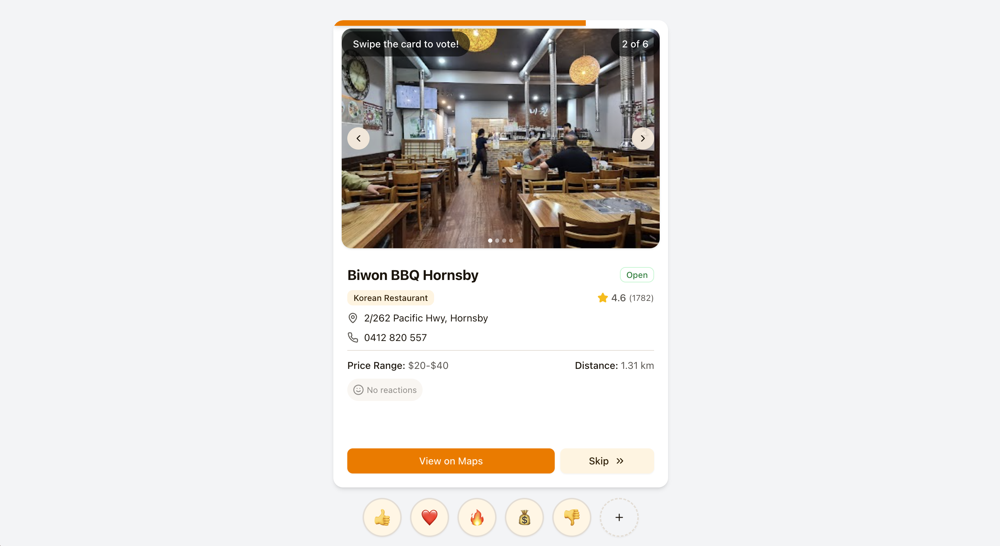

<div align="center">

  
  <h1>Tastebuds</h1>
  
  <p>
    Tastebuds is a web application that helps groups of friends collaboratively find and decide on a place to eat in real-time.
  </p>

  
<!-- Badges -->
<p>
  <a href="https://github.com/kevinh-e/tastebuds/graphs/contributors">
    
  </a>
  <a href="">
    
  </a>
  <a href="https://github.com/kevinh-e/tastebuds/network/members">
    
  </a>
  <a href="https://github.com/kevinh-e/tastebuds/stargazers">
    
  </a>
  <a href="https://github.com/kevinh-e/tastebuds/issues/">
    
  </a>
  <a href="https://github.com/kevinh-e/tastebuds/blob/master/LICENSE">
    
  </a>
</p>
   
<h4>
    <a href="https://taste-buds.live/">Live Site</a>
  <span> · </span>
    <a href="https://github.com/kevinh-e/tastebuds/issues/">Report Bug</a>
  <span> · </span>
    <a href="https://github.com/kevinh-e/tastebuds/issues/">Request Feature</a>
  </h4>
</div>

<br />

<!-- Table of Contents -->
# :notebook_with_decorative_cover: Table of Contents

- [About the Project](#star2-about-the-project)
  * [Tech Stack](#space_invader-tech-stack)
  * [Features](#dart-features)
- [Getting Started](#toolbox-getting-started)
  * [Installation](#gear-installation)
  * [Run Locally](#running-run-locally)
- [Roadmap](#compass-roadmap)
- [Contributing](#wave-contributing)
- [License](#warning-license)
- [Contact](#handshake-contact)
- [Acknowledgements](#gem-acknowledgements)
  

<!-- About the Project -->
## :star2: About the Project

> [!IMPORTANT]  
> Tastebuds is live right now! Visit the <a href="https://taste-buds.live/">live site</a>.
<div align="center"> 
  
</div>


<!-- TechStack -->
### :space_invader: Tech Stack

<details>
  <summary>Client</summary>
  <ul>
    <li><a href="https://nextjs.org/">Next.js</a></li>
    <li><a href="https://reactjs.org/">React.js</a></li>
    <li><a href="https://tailwindcss.com/">TailwindCSS</a></li>
  </ul>
</details>

<details>
  <summary>Server</summary>
  <ul>
    <li><a href="https://expressjs.com/">Express.js</a></li>
    <li><a href="https://socket.io/">SocketIO</a></li>
  </ul>
</details>

<!-- Features -->
### :dart: Features

- Real-time collaboration
- Tinder-style swiping
- Google Places integration
- Location-based search
- Preference-based filtering
- Winning restaurant announcement

<!-- Getting Started -->
## :toolbox: Getting Started

<!-- Installation -->
### :gear: Installation

Install my-project with npm

```bash
  npm install
```


<!-- Run Locally -->
### :running: Run Locally

Clone the project

```bash
  git clone https://github.com/kevinh-e/tastebuds.git
```

Go to the project directory

```bash
  cd tastebuds
```

Install dependencies

```bash
  npm install
```

Start the server

```bash
  npm run dev
```


<!-- Roadmap -->
## :compass: Roadmap

* [ ] Polish for Devsoc Starlight Hackathon

<!-- Contributing -->
## :wave: Contributing

Contributions are always welcome!

<!-- License -->
## :warning: License

Distributed under the MPL 2.0 License. See LICENSE for more information.


<!-- Contact -->
## :handshake: Contact

Project Link: [https://github.com/kevinh-e/tastebuds](https://github.com/kevinh-e/tastebuds)

<!-- Acknowledgments -->
## :gem: Acknowledgements

 - [Shields.io](https://shields.io/)
 - [Awesome README](https://github.com/matiassingers/awesome-readme)
 - [Emoji Cheat Sheet](https://github.com/ikatyang/emoji-cheat-sheet/blob/master/README.md#travel--places)
 - [Readme Template](https://github.com/othneildrew/Best-README-Template)
 - Visit our other projects:
 - [kevinh.dev](https://kevinh.dev/)
